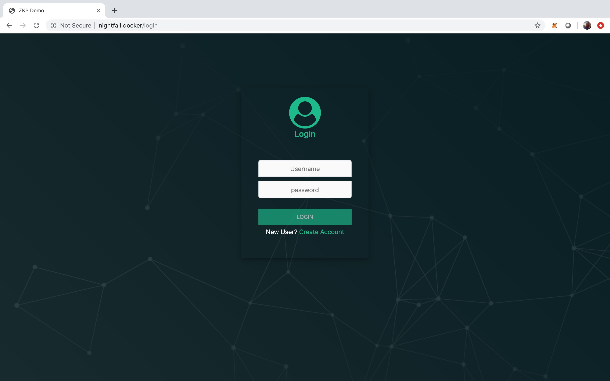
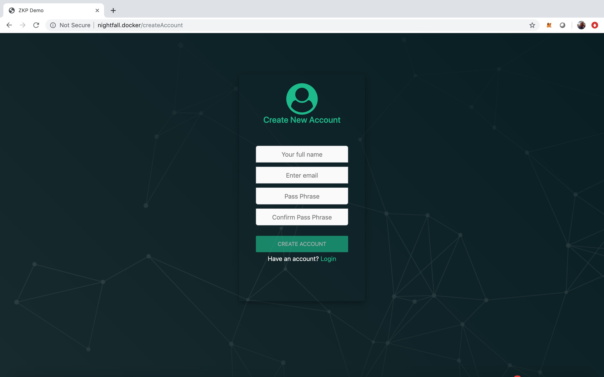
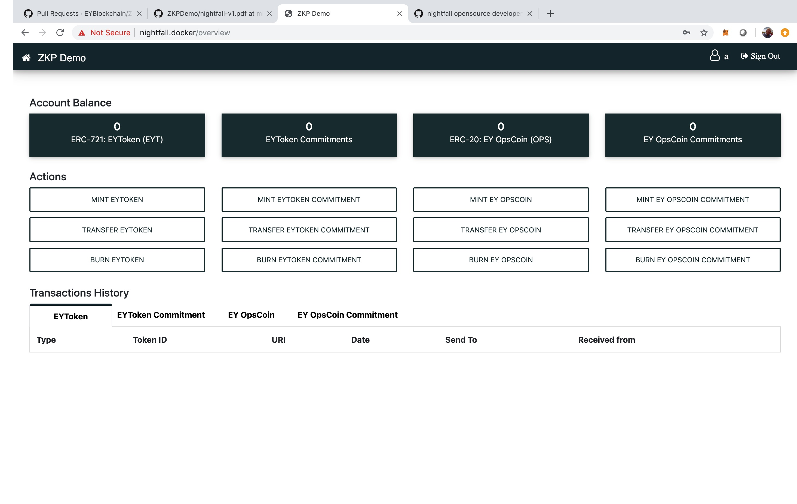
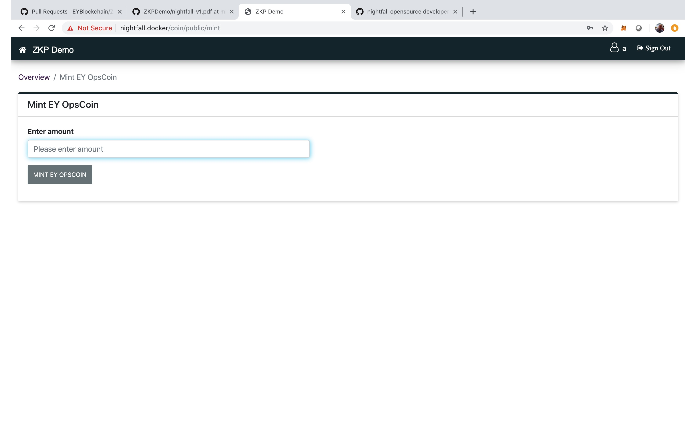
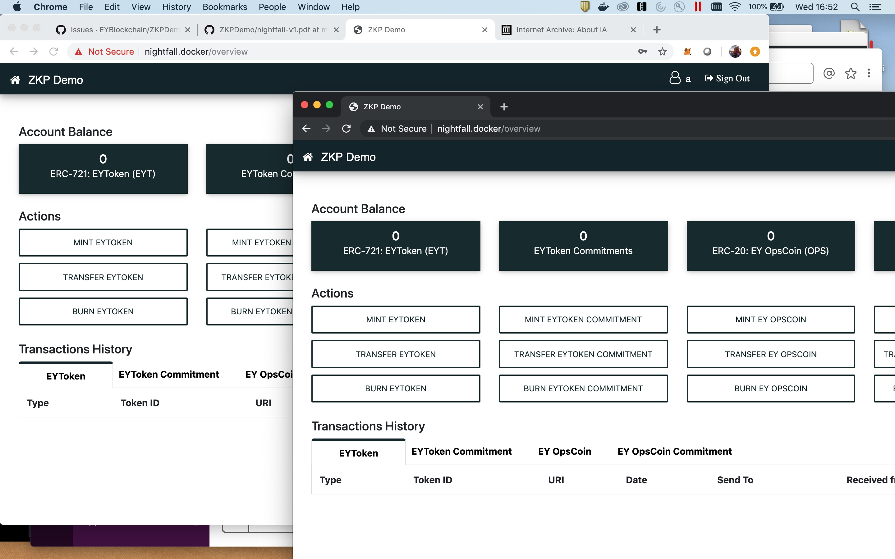
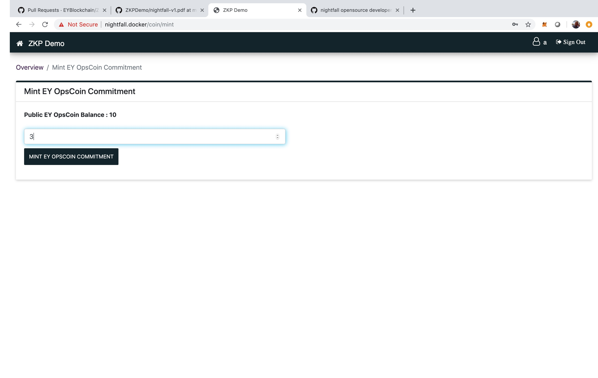
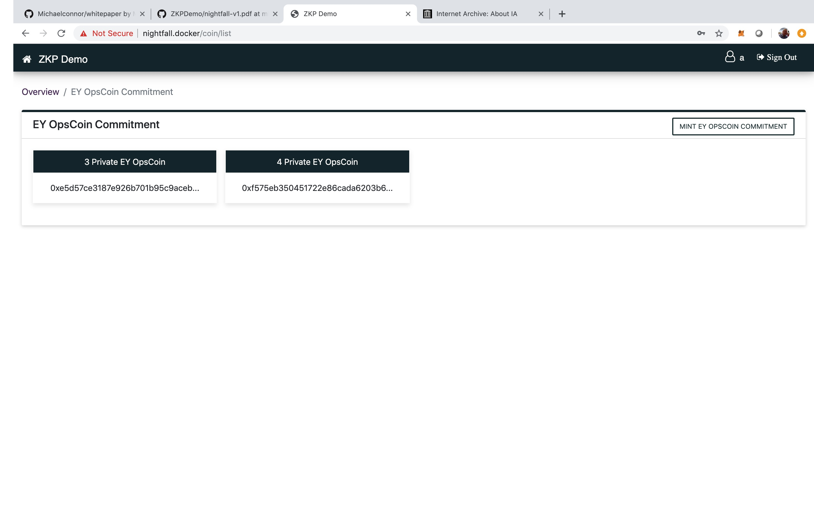
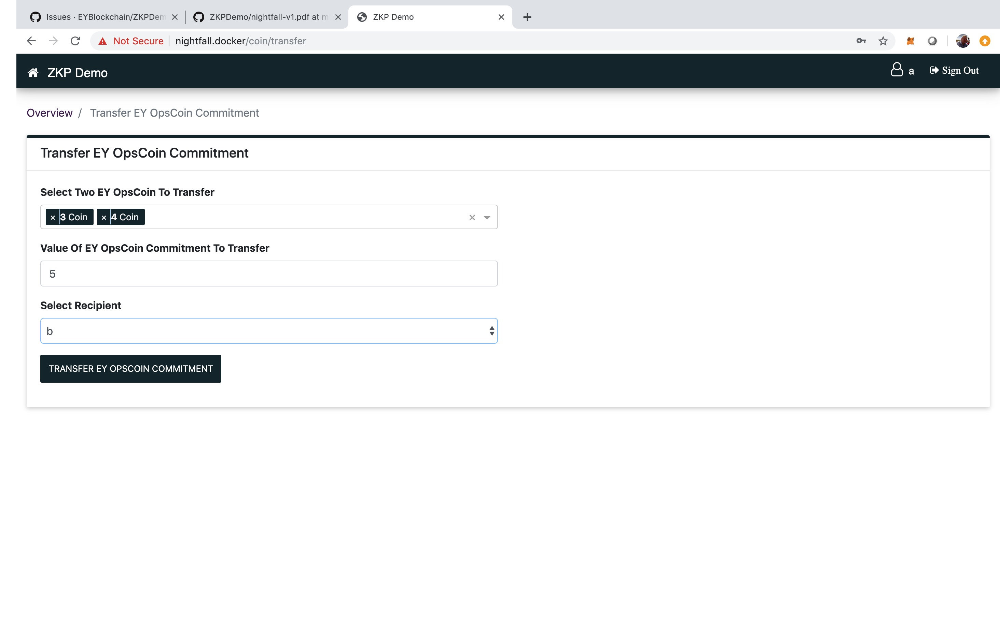
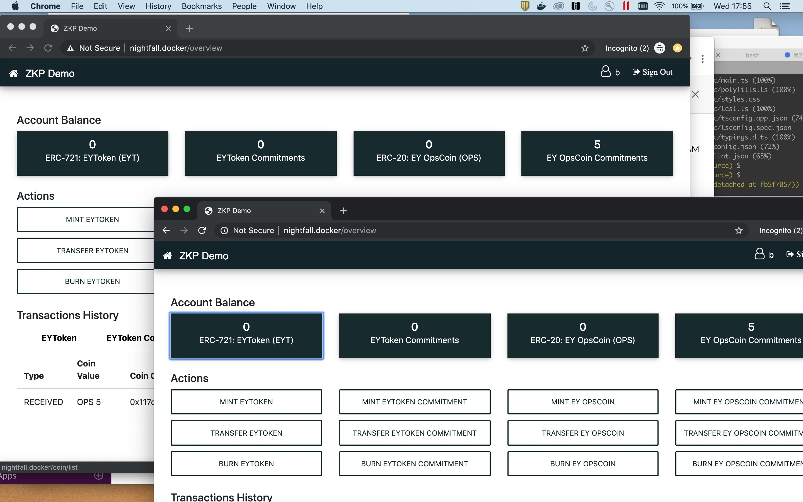

# Using the demonstration user interface

If you have followed the [README.md](./README.md) successfully, you will have the UI ready in a
browser window. The first screen you will see will be the login screen.

## Account creation and login

We have no user accounts on the system to start with (the startup script clears down the database ).
To create one, click on the `Create Account` hypertext. This will open a new window where you can
add account details. We tend just to type "a" or "b" in all fields to create Alice or Bob accounts:

Hit the `CREATE ACCOUNT` button when you are ready and you will be taken back to the login screen,
from where you can use the newly created account to log in. This will take you to the UI's home
screen:

This screen has four columns. Reading from left to right, they deal with: conventional
ERC&#x2011;721 transactions; hidden ERC&#x2011;721 transactions; conventional ERC-20 transactions
and hidden ERC&#x2011;20 transactions.

If you used the `./zkp-demo` startup script, ERC&#x2011;20 and ERC&#x2011;721 token contracts will
have been deployed for you. The name of the ERC&#x2011;20 token (EY OpsCoin in this case) has been
read from the ERC&#x2011;20 contract. These will allow you to freely create (mint), transfer and
burn (destroy) conventional tokens for demonstration purposes. In a real application you would
normally prevent this, otherwise you may suffer from runaway inflation.

You cannot use hidden (ZKP) transactions without firstly creating conventional tokens. Note that the
terms 'mint' and 'burn' when applied to hidden transactions have a slightly different meaning:
minting a hidden token actually creates a hiding for an existing conventional token and burning it
recovers the original token from the hiding.

Let's mint some ERC&#x2011;20. Click the `MINT EY OPSCOIN` button on the right. This will open a
dialogue box into which you can type the amount you wish to create:

Clicking the button will return you to the home screen and your ERC&#x2011;20 balance will have been
updated by the amount that you just minted. The tabs in the lower half of the screen will show the
history of each type of token. You should see your mint transaction in the `ERC-20: EY OPSCOIN` tab.
Transfer and Burn work in a similar way as do the ERC&#x2011;721 buttons, except here you would
enter a token URI, rather than a value (the URI doesn't have to _look_ like a URI - for example you
could just type `crypto-pizza`).

At this point in the demonstration we can only transfer tokens to user "a" because we have no other
users. While that works, it's a little pointless.

Let's set up another user. We want this second user to be logged in at the same time as "a" and be
completely independent. To do that on the same machine, we need to run up another web browser (a
separate tab won't do). There are two ways to do that. Either use a different browser (e.g. Firefox
and Chrome) or open an incognito/private-browsing window (or whatever your browser calls it). This
looks to the system like a completely separate browser application. In the screenshot below, we've
used Chrome's incognito window, created user "b" and logged them in:

We could at this point simply transfer up to 30 OPS to user "b" but that would be visible to the
entire blockchain. Instead, let's do a hidden transaction using zero knowledge proofs.

First we have to create two token commitments via the EY OpsCoin Commitment mint button. These have
a fixed denomination in terms of the underlying ERC&#x2011;20 tokens (OPS in this case). We'll mint
two with value 3 OPS and 4 OPS in user a's account. The `MINT EY OPSCOIN COMMITMENT` button lets us
do this:

Note that hidden ERC&#x2011;20 transfers always require you to mint two coins. There is no
fundamental reason why this needs to be so but the ability to combine two coins of different values
give more flexibility (e.g if you need to send x) but you only have coins of value <x). Our Zero
Knowledge proof is written expecting two coins therefore (you can of course mint one of zero value
if you wish). There is no such requirement for ERC&#x2011;721 because you can't add them.

The next screen shows our freshly minted token commitments. You can access this screen at any time
by clicking the black column-header in the Private EY OpsCoin screen:

These mints take a minute or so to complete. This is due to the time it takes to compute the minting
proof. We know it's possible to improve the constraint system and do it faster but we're mainly
focussed on the on-chain verification costs at present. The terminal screen from which you launched
`./zkp-demo` will show you what is happening.

Once we have the coins minted, we can transfer them using the transfer button
`TRANSFER EY OPSCOIN COMMITMENT`. This will open up a page where we select two coins, an amount to
transfer (must be less than the total value of the two coins: don't worry, you'll get the difference
as a change coin) and to whom it should be transferred:

Clicking transfer will begin generation of the transfer proof and finally transfer the commitment to
user b. The proof calculations will take about 10 minutes because it has to calculate a proof that
it knows a path through the Merkle tree of commitments (actually two paths - one for each coin). In
this demonstration UI we make the transfer modal so the user can track what is going on but actually
a promise is returned so there's no fundamental need to wait around.

In the picture below, you can see that Bob has received the 5 OPS commitment. User a will get a 5
OPS commitment as change:

User b can change these commitments back into ERC&#x2011;20 tokens if they wish by conducting a burn
transaction.
